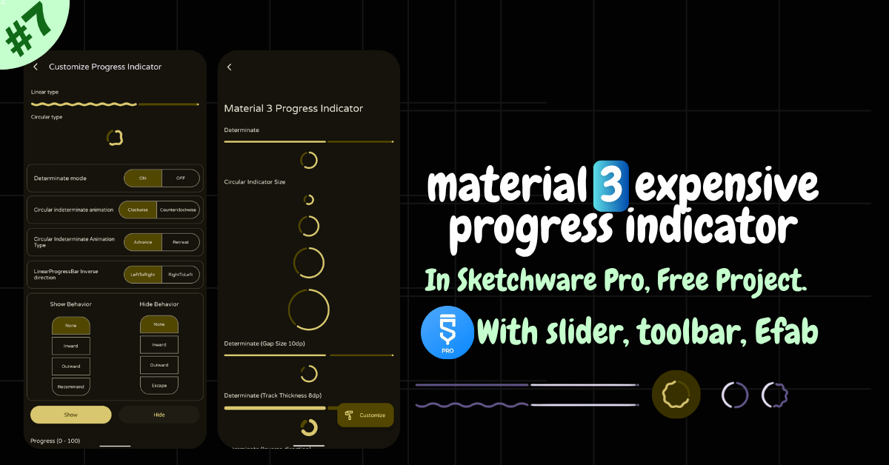

<!-- Thumbnail -->

  

  <a href="https://youtu.be/9L_yXaVab80" target="_blank">
    ▶️ **Click to Watch the Video**
  </a>

# 📱 Material 3 Progress Indicator in Sketchware Pro

This project demonstrates how to implement **Material 3 Progress Indicators** in **Sketchware Pro**, including both **Linear** and **Circular** types. It covers **determinate/indeterminate modes**, wavy **animation behaviors**, and compatibility with **Extended FABs** and **Collapsing Toolbars**.

🛠 Built using: `com.google.android.material:material:1.14.0-alpha02`

---

## ✨ Features

- 📏 Linear and Circular Progress Indicators  
- 🔄 Determinate and Indeterminate Modes  
- 🎞 Indeterminate Animation Types  
- 🧭 Custom Circular Indicator Directions  
- 🎬 Show and Hide Animation Behaviors  
- 🧩 Wavy Progress indicator Support  
- ➕ Extended Floating Action Button (FAB) Integration
- more
- 🧱 Collapsing Toolbar Support  
- ⚙️ AndroidX Compatible  
- 💡 Fully Sketchware Pro Ready  

---

## 🚀 Getting Started

⚠️ **Important:**  
Do **not disable** `exclude built-in library` in Sketchware Pro.  
This project already removes the older Material 3 library and includes the latest version manually.

### 📂 Steps:
1. Download the `.skproj` file  
2. Open it in **Sketchware Pro**  
3. Tap **Restore Project**  
4. Build and run the app  

---

## 📚 Reference

- Official Material 3 Docs (ProgressIndicator):  
  [Material Components Android](https://github.com/material-components/material-components-android/blob/master/docs/components/ProgressIndicator.md)

---

## 👨‍💻 Author

**Faster Software Developer**  
📢 Telegram: [Faster Software Developer](https://t.me/fastersoftwaredeveloper)

---

## 📄 License

This project is released under the **Creative Commons Zero v1.0 Universal (CC0 1.0)** license.  
You may copy, modify, distribute, and use it freely, even for commercial purposes.

🔗 [View Full License](https://github.com/FasterSoftwareDeveloper/Material-3-Progress-Indicator-In-Sketchware-Pro?tab=CC0-1.0-1-ov-file)
